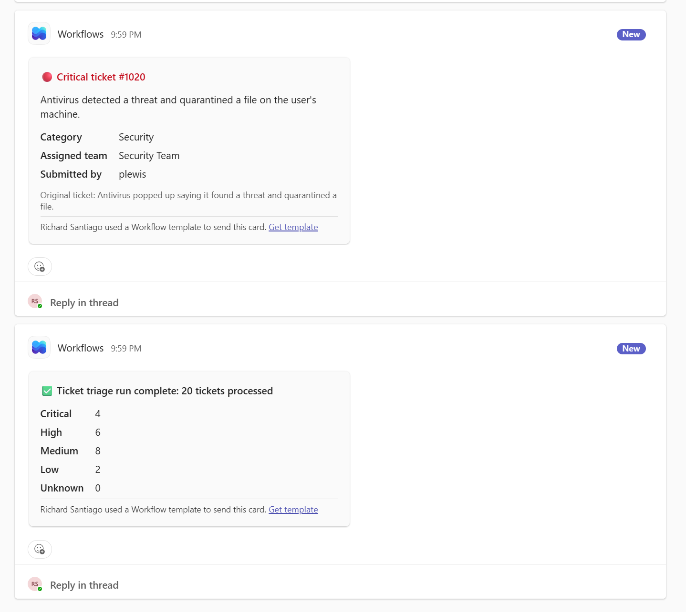

# AI Ticket Summarizer

An AI-powered automation that reads IT support tickets, then summarizes, categorizes, prioritizes, and routes each one using Azure OpenAI, and alerts the right team in Microsoft Teams when something urgent comes in. Built as part of a portfolio focused on AI orchestration for Managed Services.

## The Problem

Service desk analysts spend time reading every incoming ticket, deciding what it's about, judging how urgent it is, and figuring out who should handle it. Urgent issues can sit unnoticed in a queue. This manual triage is repetitive, slow, and inconsistent from one analyst to the next.

## What It Does

1. Reads support tickets from a CSV file
2. Sends each ticket to an Azure OpenAI model (gpt-5-mini) with a structured prompt
3. Receives back a one-sentence summary, a category, and a priority level as JSON
4. Routes each ticket to the owning team based on its category
5. Posts an alert card to a Microsoft Teams channel for every High and Critical ticket
6. Posts a summary card at the end of each run and saves all results to a CSV file

```
tickets.csv --> summarizer.py --> Azure OpenAI (gpt-5-mini)
                     |
                     +--> team routing --> tickets_summarized.csv
                     |
                     +--> teams_notifier.py --> Teams Workflows webhook --> Ticket Alerts channel
```



## Results

- Triaged and routed 20 sample tickets automatically
- Sent 10 Teams alerts for High and Critical tickets, plus a run summary (4 Critical, 6 High, 8 Medium, 2 Low)
- Security incidents went to the Security Team, network outages to the Network Team, and routine requests to the Service Desk
- Manual triage typically takes 1–2 minutes per ticket, or roughly 20–40 minutes for the same batch

| Ticket | AI Summary                                                       | Category | Priority | Assigned Team       |
| ------ | ---------------------------------------------------------------- | -------- | -------- | ------------------- |
| 1008   | Clicked a phishing email link requesting bank login verification | Security | Critical | Security Team       |
| 1012   | Customer-facing website is returning HTTP 500 errors             | Software | Critical | Application Support |
| 1009   | Wi-Fi in conference room B disconnects every few minutes         | Network  | High     | Network Team        |
| 1019   | User asks how to set up an out-of-office reply                   | Software | Low      | Application Support |

## Key Design Decisions

**Structured output.** The prompt requires JSON with fixed fields, and the API call uses JSON mode. This turns a conversational AI into a reliable component that code can act on.

**Rules for consistency.** A fixed category list and a written priority guide are included in the prompt. Without them, early testing returned invented categories like "Printer / Network" and overrated priorities.

**AI decides, rules route.** The AI classifies each ticket, but routing to a team uses a simple, auditable lookup table rather than asking the AI. Unknown categories fall back to the Service Desk.

**Reusable notification module.** All Teams logic lives in `teams_notifier.py`, separate from the triage logic. Any future automation can import it to send alert cards, and the notification channel could be swapped without touching the triage code.

**Safe failure.** If an AI call fails, the ticket is flagged "NEEDS HUMAN REVIEW" and processing continues. If a Teams alert fails, it's logged and processing continues. Neither failure can stop the run.

**Current Microsoft integration.** Uses Teams Workflows webhooks, since Microsoft retired the older Office 365 connectors (Incoming Webhook) in 2026.

**Secrets handling.** The API key and webhook URL are read from environment variables and are never stored in code or committed to the repository.

## Observations

AI classification is not perfectly repeatable. Across runs, a few borderline tickets shifted priority (for example, removing access for a departed employee moved between High and Medium). In production, this would be addressed by adding explicit examples to the priority guide and letting technicians override the AI's priority.

## Tech Stack

- Python 3
- Azure OpenAI in Microsoft Foundry (gpt-5-mini deployment)
- OpenAI Python SDK (Azure v1 endpoint)
- Microsoft Teams Workflows webhooks with Adaptive Cards

## Setup

1. Create an Azure OpenAI or Microsoft Foundry resource and deploy a chat model.
2. In Microsoft Teams, add the **Send webhook alerts to a channel** workflow to a channel and copy the webhook link.
3. Install dependencies:

```
   pip install -r requirements.txt
```

4. Set environment variables (PowerShell):

```
   $env:AZURE_OPENAI_ENDPOINT="https://your-resource.openai.azure.com"
   $env:AZURE_OPENAI_API_KEY="your-key"
   $env:AZURE_OPENAI_DEPLOYMENT="your-deployment-name"
   $env:TEAMS_WEBHOOK_URL='your-webhook-link'
```

5. Test the Teams connection, then run the full automation:

```
   python test_teams.py
   python summarizer.py
```

Teams alerts are optional. If `TEAMS_WEBHOOK_URL` is not set, the script still triages and saves results.

## Next Steps

- Move secrets into Azure Key Vault
- Replace the CSV input with a live ticketing system connection
- Add example tickets to the priority guide to improve consistency
